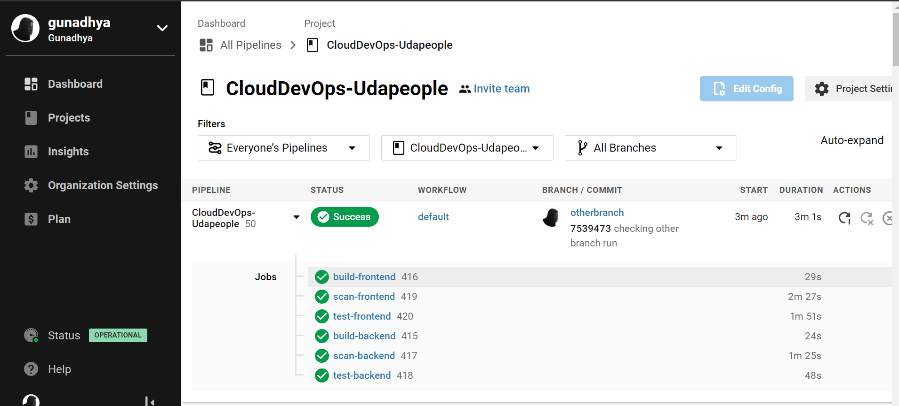
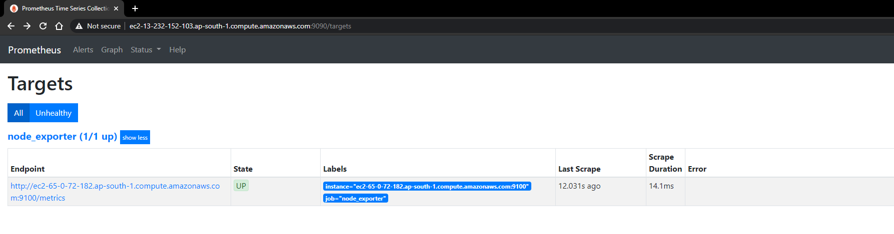

# Give your Application Auto-Deploy Superpowers

### Presentation -> [PDF](presentation.pdf)
---

# Running Screenshots
### Frontend

### Bucket

### Backend

---

# CircleCI Screenshots
### Job failed because of compile errors

### Job failed because of unit tests

### Job that failed because of vulnerable packages

### An alert for failed builds

### Fail for infrastructure creation

### Fail for the smoke test job

### Rollback after a failed smoke test

### Promotion job.

### Cleanup job 

### Deployment only works on master and not otherbranch  

### Prometheus Screenshot

### Alertmanager

### Built With

- [Circle CI](www.circleci.com) - Cloud-based CI/CD service
- [Amazon AWS](https://aws.amazon.com/) - Cloud services
- [AWS CLI](https://aws.amazon.com/cli/) - Command-line tool for AWS
- [CloudFormation](https://aws.amazon.com/cloudformation/) - Infrastrcuture as code
- [Ansible](https://www.ansible.com/) - Configuration management tool
- [Prometheus](https://prometheus.io/) - Monitoring tool

### License

[License](LICENSE.md)
